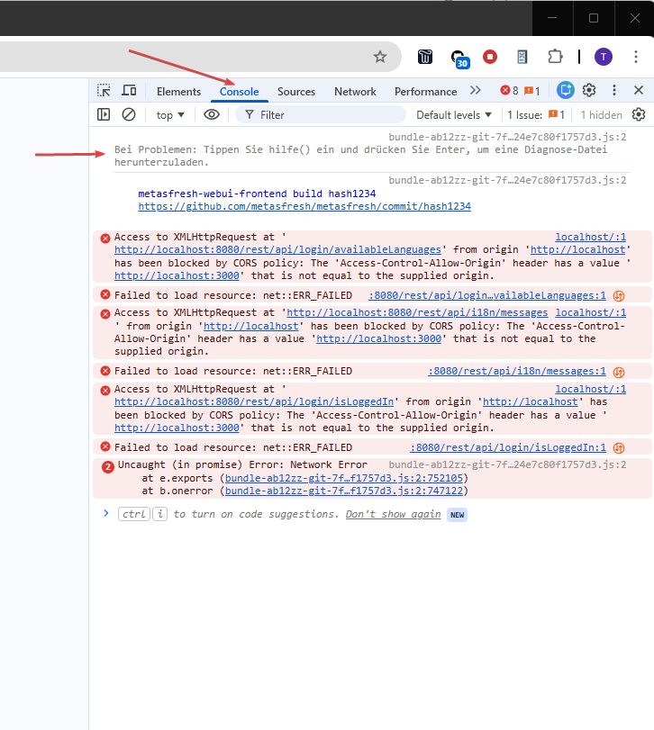
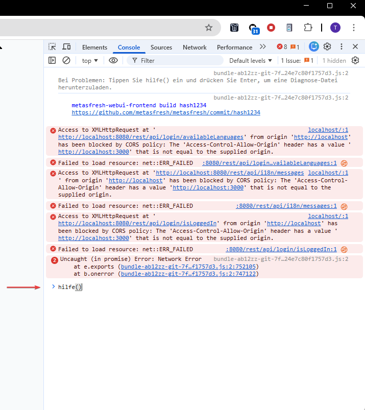
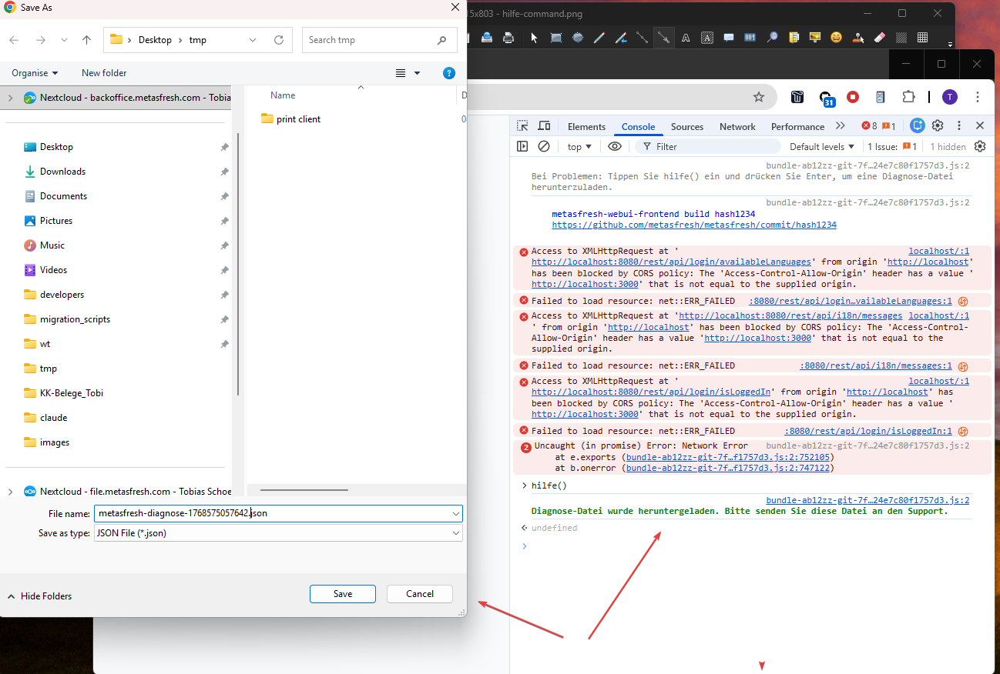

# Diagnostic Function for Application Issues (hilfe)

When you experience technical problems like a "white screen" or unexpected behavior, you can create a diagnostic file that helps support analyze the issue.

## When to Use

Use this function when:
- The application shows a white/blank screen
- Unexpected errors occur
- Features don't work as expected
- Support requests this file from you

## Step-by-Step Guide

### Step 1: Open Developer Tools and Select Console

Press **F12** on your keyboard to open the browser developer tools. Then click on the **"Console"** tab.



When the page loads, you'll see a hint message:
```
Bei Problemen: Tippen Sie hilfe() ein und drücken Sie Enter, um eine Diagnose-Datei herunterzuladen.
```
(Translation: "If you have problems: Type hilfe() and press Enter to download a diagnostic file.")

### Step 2: Enter the Command

Type the following command in the console:

```
hilfe()
```

Then press **Enter**.



### Step 3: Download the File

The browser automatically downloads a file (depending on browser settings, a Save dialog may appear):
```
metasfresh-diagnose-[timestamp].json
```

A green confirmation message appears in the console:
```
Diagnose-Datei wurde heruntergeladen. Bitte senden Sie diese Datei an den Support.
```
(Translation: "Diagnostic file has been downloaded. Please send this file to support.")



### Step 4: Send File to Support

Send the downloaded JSON file to metasfresh support via email or your ticket system.

## What Does the Diagnostic File Contain?

The file contains technical information for troubleshooting:

| Information | Description |
|-------------|-------------|
| **exportTime** | Timestamp of when the diagnostic was created |
| **buildHash** | Application version identifier |
| **browserInfo** | Browser type, language, screen size |
| **errors** | List of captured JavaScript errors |
| **events** | Log of navigation and process events (up to 200 entries) |

The **events** list records which page changes and actions took place in the application. This is especially helpful for support when analyzing unexpected redirects or page changes.

| Event Type | Description |
|------------|-------------|
| **navigation** | Every URL change (page navigation) |
| **processAction** | Result of a process execution (e.g., open document, open view) |
| **redirect** | Application-triggered redirect (e.g., automatic redirection, discard-changes dialog) |
| **popstate** | Browser back/forward navigation |

### Example Diagnostic File

```json
{
  "exportTime": "2026-01-16T14:31:22.659Z",
  "buildHash": "7fe58624e7c80f1757d3",
  "browserInfo": {
    "userAgent": "Mozilla/5.0 (Windows NT 10.0; Win64; x64) ...",
    "language": "en-US",
    "url": "http://localhost/login",
    "screen": "1920x1080",
    "window": "1200x800"
  },
  "errors": [
    {
      "timestamp": "2026-01-16T14:26:59.519Z",
      "type": "error",
      "message": "Cannot read property 'data' of undefined",
      "source": "http://localhost/bundle.js",
      "lineno": 12345,
      "stack": "Error: Cannot read property..."
    }
  ],
  "events": [
    {
      "timestamp": "2026-01-16T14:30:01.123Z",
      "type": "navigation",
      "action": "push",
      "to": "/window/143/1000000",
      "url": "http://localhost/window/143"
    },
    {
      "timestamp": "2026-01-16T14:30:15.456Z",
      "type": "processAction",
      "processId": "WEBUI_Shipment_Schedule",
      "pinstanceId": "12345",
      "actionType": "openView",
      "windowId": "540674",
      "viewId": "540674-aabbcc",
      "url": "http://localhost/window/143/1000000"
    }
  ]
}
```

## Privacy

The diagnostic file does **not** contain any personal data, passwords, or business data. Only technical information about the browser, occurred errors, and navigation/process events is captured. The events contain URL paths, process IDs, and window/view identifiers — no document contents or business data.

## FAQ

### The hilfe() function is not recognized?

Make sure you have the console open in the correct browser tab (where metasfresh is running). Reload the page (F5) and try again.

### No errors are shown in the file?

If no errors were captured, the "errors" field will be empty. Even in this case, the file contains valuable information in the "events" section, which logs all page changes and actions. Please still send the file to support and describe the problem as detailed as possible in your support ticket.

### Where can I find the downloaded file?

The file is located in your browser's download folder (usually "Downloads" in your user directory).
