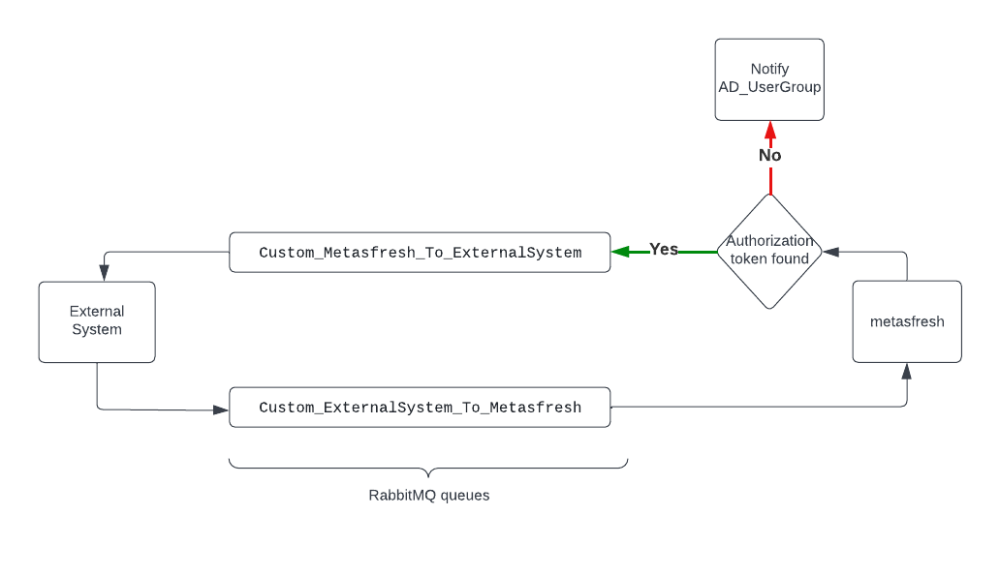

### Camel API auth-token feature

From external system side:
- At start-up camel pauses all the routes and posts a `JsonExternalSystemMessage` request to `Custom_ExternalSystem_To_Metasfresh` RabbitMQ queue.
- there is a Camel-RabbitMQ consumer listening on `Custom_Metasfresh_To_ExternalSystem`, for a `JsonExternalSystemMessage.JsonExternalSystemMessagePayload` with a configured token, for authenticating in metasfresh rest-api.
- only after metasfresh system provides a `JsonExternalSystemMessage.JsonExternalSystemMessagePayload` response all the paused camel routes are started in a controlled order.

From metasfresh side:
- when metasfresh receives a message on to `Custom_ExternalSystem_To_Metasfresh` RabbitMQ queue, it looks for `AD_Sysconfig.Name = de.metas.externalsystem.externalservice.authorization.authToken` to match an `AuthToken` from `AD_User_AuthToken`.
  - if `sysconfig` is found and matched, then the respective value is send to `Custom_Metasfresh_To_ExternalSystem`.
  - if `sysconfig` is not set or an `AD_User_AuthToken` is not found for the configured value, then a notification is sent out to the userGroup configured in `AD_Sysconfig.Name = de.metas.externalsystem.externalservice.authorization.notificationUserGroupId`.

